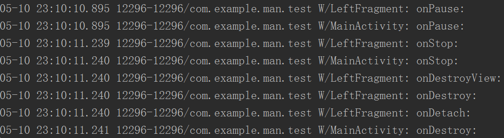

# 	第四章 Fragment
---
## Question

1. Fragment有待更精确地定义。
2. Fragment的onDestroyView()在什么情况下会调用？
3. -4.3.2-Fragment的生命周期在系统中到底是如何随着Activity变化的？
   - 《Android编程权威指南》P126

------

## Contents

1. 碎片是什么
2. 碎片的创建
3. 碎片的使用
   - 静态添加碎片
   - 动态添加碎片
   - 模拟返回栈
4. （待研究）碎片的通信
   - 活动X碎片	碎片X活动
   - 碎片X碎片
5. 碎片的生命周期
   - 状态
   - 回调方法
   - 生存期

---
## 知识结构
### 4.1 Fragment是什么
==**碎片（Fragment）**==：迷你型的活动，内嵌在活动中。（有待更精确地定义）

- Fragment同Activity一样具有布局、生命周期。手机和平板使用同一个布局，往往会造成平板屏幕上有大量空白，使用Fragment提高平板屏幕的利用率。
- Fragment真正的强大之处在于，它可以在程序运行时动态地添加到活动中。

### 4.2 Fragment的使用方式

#### 4.2.1 Fragment的简单用法

> - 有两个不同包下的Fragment可供选择，一个是系统内置的android.app.Fragment，一个是support-v4库中的android.support.v4.app.Fragment。强烈建议使用support-v4库中的Fragment，因为它可以让Fragment在所有Android系统版本中保持功能一致性。
> - 我们不需要在build.gradle文件中添加support-v4库的依赖，因为build.gradle文件中已经添加了appcompat-v7库的依赖，而appcompat-v7库会将support-v4库一起引入进来。

1. 新建Fragment布局。
2. 新建Fragment类，继承support-v4库中的Fragment。重写onCreateView()，加载1中创建的布局。
3. 在Activity布局中使用`<fragment>`标签（**f为小写**）添加Fragment控件。通过`android:name`属性来显式指定要添加的Fragment的类名，**注意一定要将类的包名写上**。
4. 在Activity中为Fragment编写各种业务逻辑。API小于11时，Activity必须继承FragmentActivity，才能使用Fragment。

> **Note:** When you add a fragment to an activity layout by defining the fragment in the layout XML file, you *cannot* remove the fragment ==at runtime==. If you plan to swap your fragments in and out during user interaction, you must add the fragment to the activity when the activity first starts, as shown in the [4.2.2 动态添加Fragment](#4.2.2 动态添加Fragment).

#### 4.2.2 动态添加Fragment

```java
	private void replaceFragment(Fragment fragment){
       	FragmentManager fragmentManager = getSupportFragmentManager();//getSupportFragmentManager()在Activity中可以直接使用。
        FragmentTransaction fragmentTransaction = fragmentManager.beginTransaction();
        fragmentTransaction.replace(R.id.fragment_contanier,fragment);//见下面解释
        fragmentTransaction.commit();
    }
```

在处理片段（尤其是在运行时添加片段的情况下）时，请谨记以下重要准则：您的 Activity 布局必须包含一个可以插入片段的容器 View。在代码中是R.id.fragment_contanier，一个FrameLayout。`repalce()`and`add()`还有第三个tag参数可加，用来之后取回该Fragment。

#### 4.2.3 在Fragment中模拟返回栈

动态添加Fragment后，按下Back键，Fragment所在的Activity会直接退出，而不是先回退到上一个Fragment。为了实现类似于返回栈的效果，可以使用FragmentTransaction提供的`addToBackStack()`，将一个事务添加到返回栈中。

```java
    private void replaceFragment(Fragment fragment){
        FragmentManager fragmentManager = getSupportFragmentManager();
        FragmentTransaction fragmentTransaction = fragmentManager.beginTransaction();
        fragmentTransaction.replace(R.id.fragment_container,fragment);
        fragmentTransaction.addToBackStack(null);//该方法使用的可选字符参数会为事务指定一个唯一的名称，一般传入null即可。
        fragmentTransaction.commit();
    }
```

非动态添加的Fragment，按下Back键，Fragment会退出，在按下Back键，Fragment所在的Activity才会退出。

#### 4.2.4 Fragment和Activity之间的通信

Fragment和Activity各自存在于一个独立的类中，无法直接调用彼此的属性和方法，需要额外的措施来进行通信。

- Activity中获取Fragment实例

```java
//如果Fragment是继承support.v4.Fragment，需要用getSupportFragmentManager()
Fragment fragment= getSupportFragmentManager().findFragmentById(R.id.left_fragment);
//如果Fragment是继承Fragment，需要用getFragmentManager()
Fragment fragment= getFragmentManager().findFragmentById(R.id.left_fragment);
```

- Fragment中获取Activity实例

```java
MainActivity activity =(MainActivity) getActivity();//
```

另外当Fragment需要使用Context对象时，也可以使用getActivity()。

- Fragment F1和Fragment F2通信

先获取F1所在的Activity A实例，然后再通过A去获取F2的实例，从而实现了碎片与碎片之间的通信。

更复杂的用法见[官方文档](https://developer.android.com/training/basics/fragments/communicating.html)

Fragment间传递数据的[两种方法](http://dwtedx.com/itshare_296.html)

[fragment findViewById()返回null完全解析](http://www.itdadao.com/articles/c15a546242p0.html)

[Fragment.setArguments()的初衷。](http://blog.csdn.net/u010940300/article/details/46516063)

### 4.3 Fragment的生命周期

#### 4.3.1 Fragment的状态和回调

- 状态
  - 运行状态：Fragment关联的Activity处在运行状态，并且Fragment处于可见的状态。
  - 暂停状态：Fragment关联的Activity处在暂停状态，与Activity相关联的Fragment就会进入到暂停状态。
  - 停止状态：①Fragment关联的Activity处在停止状态，与Activity相关联的Fragment就会进入到停止状态。②**或者通过调用FragmentTransaction的`replace()`、`remove()`将碎片从活动中移除，但是在事务提交前使用了`addToBackStack()`，这时碎片也会进入停止状态。Fragment对用户来说完全不可见。进入停止状态前会调用`onDestroyView()`，从停止状态恢复到运行状态会调用`onCreateView()`**
  - 销毁状态：①Fragment总是依附于Activity而存在，当活动被销毁时，与它相关联的碎片也会进入到销毁状态。②**或者通过调用FragmentTransaction的`replace()`、`remove()`将碎片从活动中移除，但是在事务提交前没有使用`addToBackStack()`，这时碎片也会进入销毁状态。**
- 相对于Activity新增的回调方法
  - onAttach()。当碎片和活动建立关联时调用。
  - onCreateView() 。当创建碎片视图（加载布局）时调用。
  - onActivityCreated()。当与碎片相关联的活动已经创建完成，并且碎片视图已经实例化时调用。
  - onDestroyView()。当与碎片相关联的视图被移除时调用
  - onDetach()。当碎片和活动接触关联时调用。


| Fragment的生命周期                            | Activity 生命周期对片段生命周期的影响                  |
| :--------------------------------------- | :--------------------------------------- |
|  |  |

> Tips：Activity中包含Fragment时，Activity的onResume()比Fragment的onResume()先调用。


#### 4.3.2 Fragment的生命周期与Activity的关系

> LeftFragment是MainActivity布局文件中的一个控件。以下图片为LeftFragment随着MainActivity的生命周期的变化。Fragment的生命周期应该是随着Activity改变的，但是实际打印出来却是Fragment先变化。这里存在一点疑问。比如我按下Back键，显然是告诉系统Activity要退出，所以才会销毁Fragment，但是先销毁的却是Fragment，然后才是Activity，有点像栈。




#### 4.3.3 体验Fragment的生命周期

**注意：**AnotherRightFragment替换了RightFragment，此时的RightFragment进入了停止状态，onDestroyView()会得到执行。按下Back键，RightFragment进入运行状态，**onCreateView()会得到执行**。**书上P156说的是错误的**

### 4.4 动态加载布局的技巧

#### 4.4.1 使用限定符（Qualifiers）

使用限定符系统会根据屏幕特征自动选择使用哪个资源布局。以下有3种限定符：

- 大小：small、normal、large、xlarge
- 分辨率：ldpi、mdpi、hdpi、xhdpi、xxhdpi
- 方向：land、port

使用方法：在res目录下新建一个layout-large文件夹，将layout XML files 放入即可让屏幕为large的设备加载layout-large下的layout。

补充：

1. [分辨率、DPI、PPI和屏幕尺寸，你都知道是啥么？](http://www.cnblogs.com/imjustice/p/resolution_dpi_ppi_screen_size.html)
2. [Android开发：最全面、最易懂的Android屏幕适配解决方案](http://www.jianshu.com/p/ec5a1a30694b#)

#### 4.4.2 使用最小宽度限定符（Smallest-Qualifiers）

使用最小宽度限定符允许我们对屏幕宽度设置一个最小值（以dp为单位）。根据这个最小值选定加载哪一个布局，而不是按照系统的标准选择。

使用方法：在res目录下新建一个layout-sw600dp文件夹，将layout XML files 放入即可让屏幕宽度大于600dp的设备加载layout-sw600dp种的layout。

### 4.5 Fragment的最佳实践——一个简易版的新闻应用

任务：写一个能同时兼容手机和平板的新闻应用。