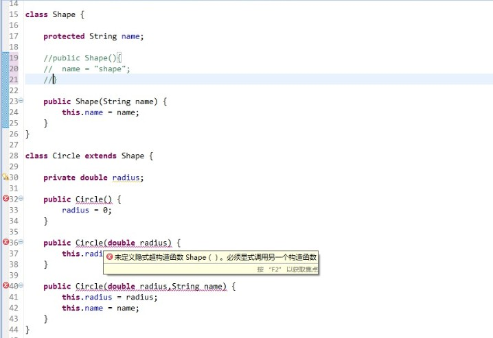

# 类与继承

　　对于面向对象的程序设计语言来说，类毫无疑问是其最重要的基础。抽象、封装、继承、多态这四大特性都离不开类，只有存在类，才能体现面向对象编程的特点，今天我们就来了解一些类与继承的相关知识。首先，我们讲述一下与类的初始化相关的东西，然后再从几个方面阐述继承这一大特性。以下是本文的目录大纲：

　　一.你了解类吗？

　　二.你了解继承吗？

　　三.常见的面试笔试题

　　若有不正之处，请多多谅解并欢迎批评指正。

　　请尊重作者劳动成果，转载请标明原文链接：

　　http://www.cnblogs.com/dolphin0520/p/3803432.html


## 一.你了解类吗？

　　在Java中，类文件是以.java为后缀的代码文件，在每个类文件中**最多只允许出现一个public类**，当有public类的时候，类文件的名称必须和public类的名称相同，若不存在public，则类文件的名称可以为任意的名称（当然以数字开头的名称是不允许的）。

　　在类内部，对于成员变量，如果在定义的时候没有进行显示的赋值初始化，则Java会保证类的每个成员变量都得到恰当的初始化：

　　1）对于  char、short、byte、int、long、float、double等基本数据类型的变量来说会默认初始化为0（boolean变量默认会被初始化为false）；

　　2）对于引用类型的变量，会默认初始化为null。

​	3)   对于方法中的局部变量，Java不会为其初始化，需要手工进行初始化。

　　如果没有显示地定义构造器，则编译器会自动创建一个无参构造器，但是要记住一点，**如果显示地定义了构造器，编译器就不会自动添加构造器。注意，所有的构造器默认为static的。**

　　下面我们着重讲解一下 ==初始化 顺序==：

　　当程序执行时，需要生成某个类的对象，Java执行引擎会先检查是否加载了这个类，如果没有加载，则先执行类的加载再生成对象，如果已经加载，则直接生成对象。

　　在类的加载过程中，类的static成员变量会被初始化，另外，如果类中有static语句块，则会执行static语句块。static成员变量和static语句块的执行顺序同代码中的顺序一致。记住，**在Java中，类是按需加载，只有当需要用到这个类的时候，才会加载这个类，并且只会加载一次。**看下面这个例子就明白了：

```Java
public class Test {
    public static void main(String[] args) throws ClassNotFoundException {
         
        Bread bread1 = new Bread();
        Bread bread2 = new Bread();
    }
}
 
 
class Bread {
    static{
        System.out.println("Bread is loaded");
    }
    public Bread() {
        System.out.println("bread");
    }
}
```

　　运行这段代码就会发现"Bread is loaded"只会被打印一次。

　　在**生成对象的过程中，会先初始化对象的成员变量，然后再执行构造器。**也就是说类中的变量会在任何方法（包括构造器）调用之前得到初始化，即使变量散步于方法定义之间。

```Java
public class Test {
    public static void main(String[] args)  {
        new Meal();
    }
}
 
 
class Meal {
     
    public Meal() {
        System.out.println("meal");
    }
     
    Bread bread = new Bread();
}
 
class Bread {
     
    public Bread() {
        System.out.println("bread");
    }
}
```

　　输出结果为：

```
bread
meal
```


## 二.你了解继承吗？

　　继承是所有OOP语言不可缺少的部分，在java中使用extends关键字来表示继承关系。当创建一个类时，总是在继承，如果没有明确指出要继承的类，就总是隐式地从根类Object进行继承。比如下面这段代码：

```Java
class Person {
    public Person() {
         
    }
}
 
class Man extends Person {
    public Man() {
         
    }
}
```

　　类Man继承于Person类，这样一来的话，Person类称为父类（基类），Man类称为子类（导出类）。如果两个类存在继承关系，则子类会自动继承父类的方法和变量，在子类中可以调用父类的方法和变量。**在java中，只允许单继承，也就是说 一个类最多只能显示地继承于一个父类。但是一个类却可以被多个类继承，也就是说一个类可以拥有多个子类。**

　　1.子类继承父类的成员变量

　　当子类继承了某个类之后，便可以使用父类中的成员变量，但是并不是完全继承父类的所有成员变量。具体的原则如下：

　　1）能够继承父类的public和protected成员变量；**不能够继承（访问）父类的private成员变量**；

　　2）对于父类的包访问权限成员变量，如果子类和父类在同一个包下，则子类能够继承；否则，子类不能够继承；

　　3）对于子类可以继承的父类成员变量，**如果在子类中出现了同名称的成员变量，则会发生==隐藏==现象，即子类的成员变量会屏蔽掉父类的同名成员变量。**如果要在子类中访问父类中同名成员变量，需要使用`super`关键字来进行引用。

　　2.子类继承父类的方法

　　同样地，子类也并不是完全继承父类的所有方法。

　　1）能够继承父类的public和protected成员方法；不能够继承父类的private成员方法；

　　2）对于父类的包访问权限成员方法，如果子类和父类在同一个包下，则子类能够继承；否则，子类不能够继承；

　　3）对于子类可以继承的父类成员方法，**如果在子类中出现了同名称的成员方法，则称为==覆盖==，即子类的成员方法会覆盖掉父类的同名成员方法。**如果要在子类中访问父类中同名成员方法，需要使用`super`关键字来进行引用。

　　==注意：隐藏和覆盖是不同的。**隐藏是针对成员变量和静态方法的，而覆盖是针对普通方法的。**==（后面会讲到）

　　3.构造器

　　子类是不能够继承父类的构造器，但是要注意的是，**如果父类的构造器都是带有参数的，则必须在子类的构造器中显示地通过super关键字调用父类的构造器并配以适当的参数列表。**如果父类有无参构造器，则在子类的构造器中用super关键字调用父类构造器不是必须的，如果没有使用super关键字，系统会自动调用父类的无参构造器。（**==生成子类的对象时，需要先生成父类的对象。==**也就是，调用子类的构造器时会先调用父类的构造器。）看下面这个例子就清楚了：

```Java
class Shape {
     
    protected String name;
     
    public Shape(){
        name = "shape";
    }
     
    public Shape(String name) {
        this.name = name;
    }
}
 
class Circle extends Shape {
     
    private double radius;
     
    public Circle() {
        radius = 0;
    }
     
    public Circle(double radius) {
        this.radius = radius;
    }
     
    public Circle(double radius,String name) {
        this.radius = radius;
        this.name = name;
    }
}
```

　　这样的代码是没有问题的，如果把父类的无参构造器去掉，则下面的代码必然会出错：



　　改成下面这样就行了：

```Java
class Shape {
     
    protected String name;
     
    public Shape(String name) {
        this.name = name;
    }
}
 
class Circle extends Shape {
     
    private double radius;
     
    public Circle() {
        super("cicle");
        radius = 0;
    }
     
    public Circle(double radius) {
        super("cicle");
        this.radius = radius;
    }
     
    public Circle(double radius,String name) {
        super(name);
        this.radius = radius;
        this.name = name;
    }
}
```

　　4.super

　　super主要有两种用法：

　　1）super.成员变量/super.成员方法;

　　2）super(parameter1,parameter2....)

　　第一种用法主要用来在子类中调用父类的同名成员变量或者方法；第二种主要用在子类的构造器中显示地调用父类的构造器，要注意的是，**如果是用在子类构造器中，则必须是子类构造器的第一个语句。**


## 三.常见的面试笔试题

1.下面这段代码的输出结果是什么？

```Java
public class Test {
    public static void main(String[] args)  {
        new Circle();
    }
}
 
class Draw {
    static {
        System.out.println("Draw静态代码块");
    }
    
    public Draw(String type) {
        System.out.println(type+" draw constructor");
    }
}

class Shape {
    static {
        System.out.println("Shape静态代码块");
    }
    
    private Draw draw = new Draw("shape");

    public Shape(){
        System.out.println("shape constructor");
    }
}

class Circle extends Shape {
    static {
        System.out.println("Circle静态代码块");
    }
    
    private Draw draw = new Draw("circle");
    
    public Circle() {
        System.out.println("circle constructor");
    }
}
```

结果如下所示：

```
Shape静态代码块
Circle静态代码块
Draw静态代码块
shape draw constructor
shape constructor
circle draw constructor
circle constructor
```

　　执行过程：加载Shape类——》加载Cirlce类——》加载Draw类——》调用main()——》生成shape对象（先初始化成员变量，生成draw对象——》调用shape构造器）——》生成circle对象（先初始化成员变量——》生成draw对象——》调用circle构造器）。//加载类和生成对象是两个阶段，不要搞混。加载类一般都是在程序正式运行前。

​	这道题目主要考察的是类继承时构造器的调用顺序和初始化顺序。要记住一点：父类的构造器调用以及初始化过程一定在子类的前面。由于Circle类的父类是Shape类，所以Shape类先进行初始化，然后再执行Shape类的构造器。接着才是对子类Circle进行初始化，最后执行Circle的构造器。

2.下面这段代码的输出结果是什么？

```Java
public class Test {
    public static void main(String[] args)  {
        Shape shape = new Circle();
        System.out.println(shape.name);
        shape.printType();
        shape.printName();
    }
}
 
class Shape {
    public String name = "shape";
     
    public Shape(){
        System.out.println("shape constructor");
    }
     
    public void printType() {
        System.out.println("this is shape");
    }
     
    public static void printName() {
        System.out.println("shape");
    }
}
 
class Circle extends Shape {
    public String name = "circle";
     
    public Circle() {
        System.out.println("circle constructor");
    }
     
    public void printType() {
        System.out.println("this is circle");
    }
     
    public static void printName() {
        System.out.println("circle");
    }
}
```

结果如下所示：

```
shape constructor
circle constructor
shape
this is circle
shape
```

　　这道题主要考察了隐藏和覆盖的区别（当然也和多态相关，在后续博文中会继续讲到）。

　　==覆盖只针对非静态方法（终态方法不能被继承，所以就不存在覆盖一说了），而隐藏是针对成员变量和静态方法的。这2者之间的区别是：覆盖受RTTI（Runtime type  identification）约束的，而隐藏却不受该约束。也就是说只有覆盖方法才会进行动态绑定，而隐藏是不会发生动态绑定的。在Java中，除了static方法和final方法，其他所有的方法都是动态绑定。因此，就会出现上面的输出结果。== 可参考《Java核心技术卷Ⅰ》P155-5.1.6